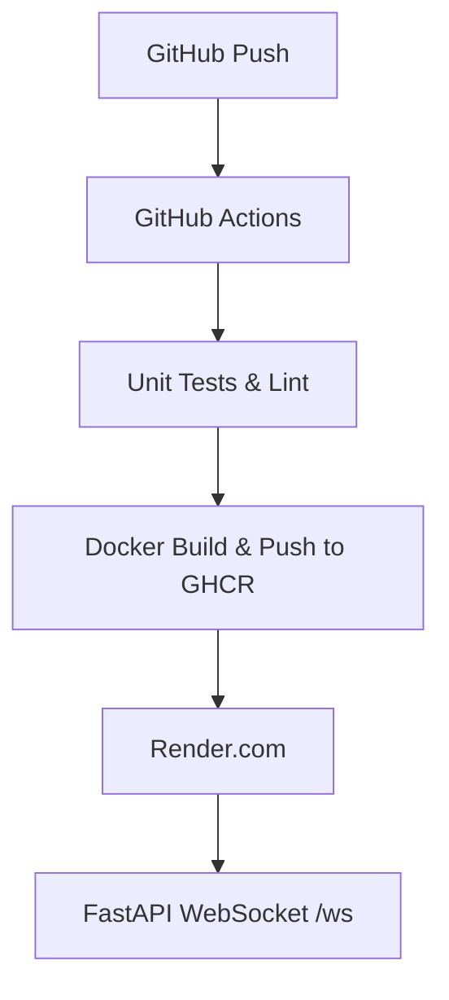

## End-to-End YOLO MLOps Pipeline

This project demonstrates how to productionize a YOLOv8n inference service using FastAPI, WebSockets, Docker, GitHub Actions, and free-tier Render.com hosting. It includes ONNX export, dynamic INT8 quantization, and CI/CD automation for zero-ops deployments.

### Performance Considerations

- **Model export**: YOLOv8n ➔ ONNX (`yolov8n.onnx`)  
- **Quantization**: dynamic INT8 quantization (`yolov8n_int8.onnx`) for CPU acceleration  
- **Frame size**: resize incoming frames to **320×320**  
- **ONNX Runtime**: CPUExecutionProvider  
- **Observed throughput** (logs):  
  ```text
  0: 320×320 1 person, 1100.1 ms
    Speed: 496 ms preprocess, 1100 ms inference, 504 ms postprocess
  0: 320×320 1 person, 803 ms
    Speed: 699 ms preprocess, 803 ms inference, 500 ms postprocess
  0: ~1–2 frames/sec on a free-tier CPU-only container

> **In production**, you’d typically:
>
> * Deploy on GPU-enabled hardware
> * Use a smaller backbone (e.g. YOLO-nano) or further prune/quantize (FP16/INT8)
> * Batch or throttle frames to balance latency and throughput

This demo focuses on the **MLOps pipeline**—CI/CD, containerization, model export & quantization, and WebSocket streaming—rather than extreme real-time performance.

### Architecture Diagram


### Usage
```python
# Start Python client to stream webcam:
python client.py --ws-url ws://<your-domain>/ws
```