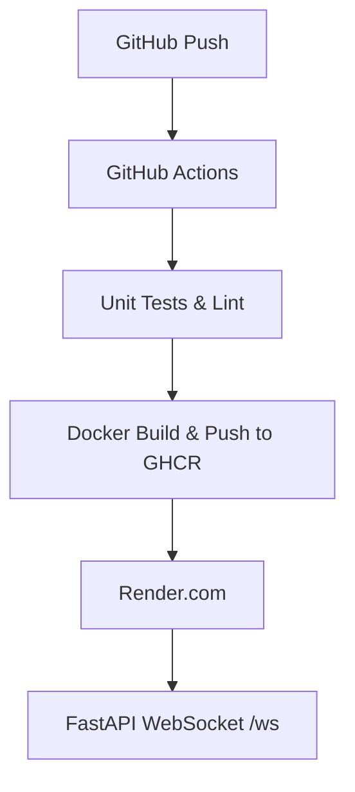

## End-to-End YOLO MLOps Pipeline

This project demonstrates how to productionize a YOLOv8 inference service using FastAPI, WebSockets, Docker, GitHub Actions, and free-tier Render.com hosting.

### Performance Considerations

- **Frame size**: incoming frames are resized to **320×320** to speed up inference.
- **ONNX Runtime**: we export YOLOv8n to ONNX for faster CPU execution.
- **Observed throughput**: ~1–2 fps on a free-tier CPU-only container at 320×320.

> **In production**, you’d typically:
> - Deploy on GPU-enabled hardware  
> - Quantize or prune the model  
> - Batch or skip frames  
> - Use a smaller backbone (e.g. YOLOv8n-nano)  

This demo focuses on the **MLOps pipeline**—CI/CD, containerization, and WebSocket delivery—rather than raw real-time performance.


### Architecture Diagram


### Usage
```python
# Start Python client to stream webcam:
python client.py --ws-url ws://<your-domain>/ws
```